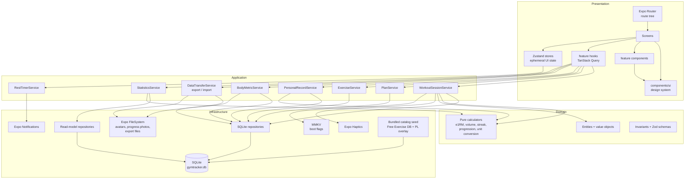
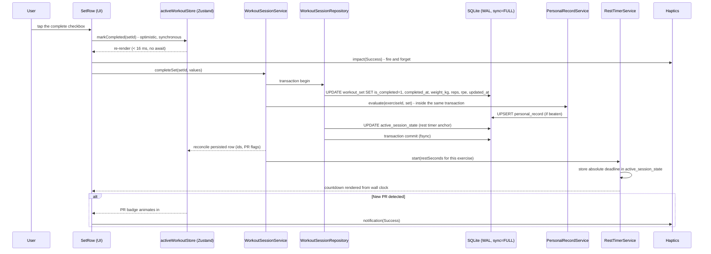
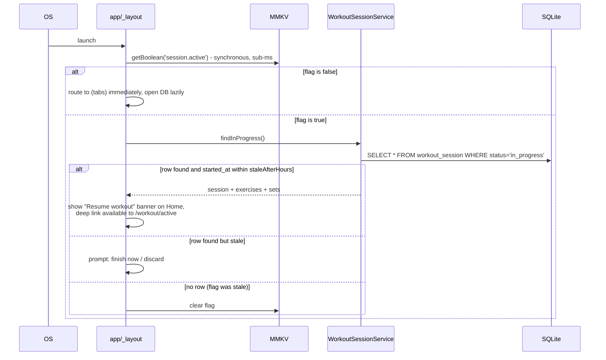
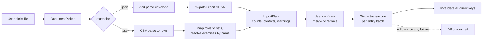
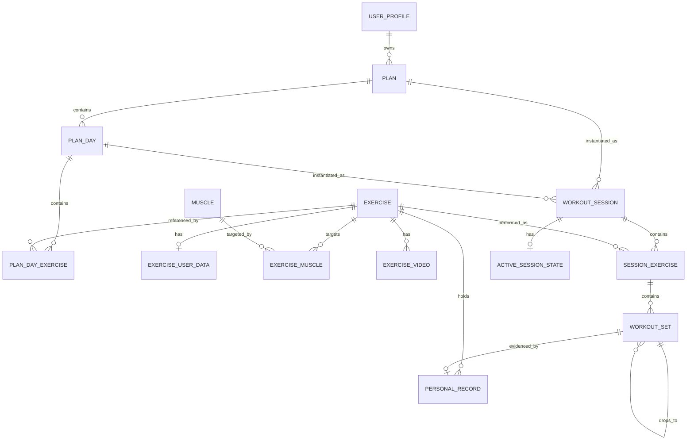
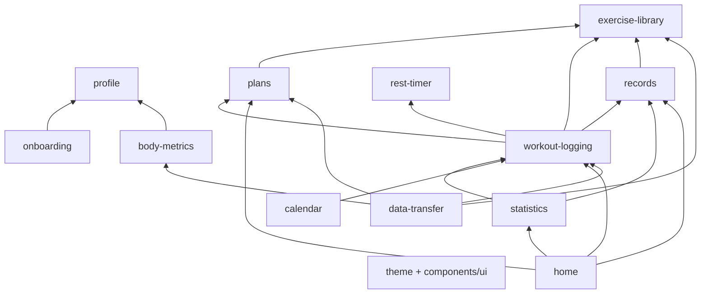
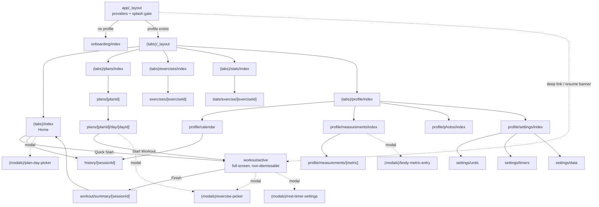

# GymTracker - System Architecture

Status: accepted
Version: 1.1
Date: 2026-08-04 (accepted 2026-08-04 - all open questions resolved, see section 18)
Source of truth for product scope: `docs/PRODUCT-BRIEF.md`
Decision records: `docs/adr/`
Build sequence: `docs/ROADMAP.md`

---

## 1. Product summary

GymTracker is an offline-only, single-user, dark-mode mobile application for logging
strength training. The product bet is speed: a set must be loggable in 2-3 seconds,
one-handed, in a noisy gym, without typing. Everything else in the app (plans,
statistics, measurements, calendar) exists to feed or to read from that one interaction.

There is no backend, no account, no cloud, no multi-user model. The device is the
system boundary. This is a deliberate constraint, not a temporary shortcut, and it
shapes every decision below: there is no network failure mode, no auth model, no
server-side authorization, no API surface. In exchange, the two hardest problems move
to the client: **local data integrity** and **crash safety**.

### 1.1 Users and roles

There is exactly one role: the device owner. There is no admin, no moderator, no guest.
The authorization model is therefore trivial and is documented in section 12 only to
record why it is empty and what would change if sync were ever added.

### 1.2 Business model

None. No revenue, no ads, no subscription, no telemetry-driven product loops. The app
is a portfolio-grade, store-publishable product. This removes an entire class of
concerns (payment processing, entitlement checks, receipt validation, GDPR data
subject requests against a server) and lets complexity budget go into the logging UX
and the data model.

---

## 2. Requirements

### 2.1 Functional requirements

| ID | Requirement | Priority |
|----|-------------|----------|
| FR-01 | First launch collects a nickname and optional avatar, stored locally. No auth. | MVP |
| FR-02 | Unlimited workout plans, each with unlimited workout days, reorderable, duplicable, renamable, deletable. | MVP |
| FR-03 | Exercise catalog seeded from Free Exercise DB with images, instructions, muscles, equipment, level. | MVP |
| FR-04 | Optional Polish display name rendered as `English Name (Polska nazwa)` when a translation exists. | MVP |
| FR-05 | Curated YouTube technique video links per exercise (URLs only, never downloaded or embedded offline). | MVP |
| FR-06 | Instant search and filtering by name, muscle, equipment, body part, favorites. | MVP |
| FR-07 | User-created custom exercises with name, muscle group, equipment, notes. | MVP |
| FR-08 | Favorites, sorted first in every exercise list. | MVP |
| FR-09 | Active workout screen: per exercise show previous performance, previous best, current sets, weight, reps, optional RPE, completed state. | MVP |
| FR-10 | Set types: warm-up, normal, drop set, failure, assisted, partial. Supersets modeled as a link between exercises (see ADR-0006). | MVP |
| FR-11 | New sets pre-fill from the previous set's values. | MVP |
| FR-12 | Quick adjust controls: +/-1 rep, +/-1.25 / 2.5 / 5 / 10 kg. Typing is always optional. | MVP |
| FR-13 | Completing a set persists immediately, starts the rest timer, fires haptic feedback. | MVP |
| FR-14 | Rest timer: automatic, global default, per-exercise override, sound, vibration, local notification, accurate across backgrounding and process death. | MVP |
| FR-15 | Progressive overload panel: previous weight, previous reps, best weight, best reps, suggested next progression. | MVP |
| FR-16 | Exercise-level notes and workout-level notes. | MVP |
| FR-17 | Workout summary after finishing: duration, exercises, sets, volume, optional estimated calories, new PRs. | MVP |
| FR-18 | Home screen: active plan, Quick Start, last workout, training streak, latest PR, weekly summary. | MVP |
| FR-19 | **An in-progress workout must survive process death and be resumable.** Hard requirement. | MVP |
| FR-20 | Gestures: swipe left deletes a set (with undo), swipe right edits a set, drag reorders exercises. | MVP |
| FR-21 | Statistics: workout frequency, duration, volume, per-exercise progression, estimated 1RM, PR list, muscle-group volume, monthly and yearly views. | Phase 2 |
| FR-22 | Monthly calendar of completed workouts showing duration, volume and which plan day was used. | Phase 2 |
| FR-23 | Body measurements: weight, body fat, chest, waist, neck, arms, forearms, thighs, calves, with history. | Phase 2 |
| FR-24 | Progress photos stored on-device with history. | Phase 2 |
| FR-25 | JSON export and import (lossless backup/restore) and CSV export and import (lossy interchange). | Phase 2 |
| FR-26 | Settings: nickname, avatar, units (kg/lb, cm/in), timer defaults, export, import. | MVP (partial) / Phase 2 (data) |

### 2.2 Non-functional requirements

| ID | Requirement | Target | How it is verified |
|----|-------------|--------|--------------------|
| NFR-01 | Time to log one completed set | <= 2 interactions, <= 100 ms perceived | Manual timing on the set-complete path; no `await` on the render path |
| NFR-02 | Cold start to interactive Home | < 1.5 s on a mid-range Android device | Startup trace; DB opened lazily off the splash gate |
| NFR-03 | Exercise search response | < 50 ms for ~900 catalog rows | FTS5 query benchmark (ADR-0003) |
| NFR-04 | Workout history list scroll | 60 fps with 1000+ sessions | FlashList with fixed row estimates, benchmark fixture in phase P15 |
| NFR-05 | Durability of a completed set | Survives app kill; survives OS crash | WAL + `synchronous=FULL`, E2E kill test (ADR-0005) |
| NFR-06 | Data loss on uninstall | Total and expected; export is the only backup | Documented in settings UI |
| NFR-07 | Type safety | `strict: true`, zero `any`, zero `@ts-expect-error` without a comment | `tsc --noEmit` in CI, ESLint `no-explicit-any` as error |
| NFR-08 | Offline correctness | 100% of features work in airplane mode except YouTube link opening | E2E in airplane mode |
| NFR-09 | Binary size | < 120 MB download on both stores | Measured at P16; see ADR-0011 asset budget |
| NFR-10 | Accessibility | Minimum 44x44 pt touch targets, dynamic type respected on text, screen-reader labels on all controls | RNTL a11y assertions + manual VoiceOver/TalkBack pass |

### 2.3 Explicit non-goals

No backend. No sync. No accounts. No social features. No light theme. No web build.
No wearable app. No Health/Health Connect integration. No AI coach. These are
backlog items in `docs/ROADMAP.md`, deliberately excluded from v1.0.

---

## 3. Architectural style

**Clean Architecture with a modular, feature-sliced structure**, running as a single
React Native process. No microservices, no event bus, no CQRS write side - those would
be ceremony on a single-user local app. Two ideas from that family *are* used because
they pay for themselves here:

- **A read/write split (CQRS-lite).** Statistics and history queries do not load
  entities through repositories and then aggregate in JS. They go through dedicated
  read-model repositories that return flat DTOs from SQL aggregates. Loading 60,000
  set entities into JS to sum a year of volume is the single most likely performance
  failure of an app like this, and the read/write split prevents it structurally.
- **Aggregate boundaries.** A workout session, its exercises and its sets are one
  aggregate written through one repository in one transaction. This is what makes
  crash safety provable and what makes a future sync layer have a sane conflict unit.

### 3.1 Layers and the dependency rule

```
Presentation      screens, components, hooks, Zustand stores, navigation
      |  depends on
Application       feature services (use cases), orchestration, transactions
      |  depends on
Domain            entities, value objects, pure calculators, invariants
      ^  implemented by
Infrastructure    SQLite repositories, FileSystem, notifications, MMKV, haptics
```

Rules, enforced by ESLint `import/no-restricted-paths` (configured in P0):

1. Dependencies point inward only. Domain imports nothing from React, Expo or SQLite.
2. Infrastructure implements ports (interfaces) declared by the feature that owns them.
   Nothing outside `database/` and `**/repository/*.ts` may touch a SQLite handle.
3. Presentation never imports a repository directly. It calls feature services through
   hooks, and hooks are the only place TanStack Query is used.
4. Cross-feature imports are allowed only through a feature's public `index.ts` barrel.
   Reaching into `features/x/internal/...` from `features/y` is a lint error.

### 3.2 Why not a simpler structure

A flat `screens/ + api/` structure would ship the MVP faster. It was rejected because
of a specific, concrete cost in this product: the progression, PR, volume and 1RM rules
are business logic that must be identical in five places (active workout hints,
summary, exercise detail, statistics, export). Without a domain layer that logic gets
copy-pasted and drifts, and drifted PR logic silently corrupts the user's history -
which is unrecoverable in an app with no server-side source of truth.

### 3.3 Why not heavier (Hexagonal with full DI container, event sourcing)

Event sourcing on a single-user local DB would give perfect auditability and nothing
else, at the cost of every query becoming a projection. Rejected. A full DI framework
(InversifyJS, tsyringe) adds decorators, reflect-metadata and startup cost for a
container that has ~15 registrations; a hand-written typed factory (section 8.4)
covers it in 60 lines.

---

## 4. Component diagram



---

## 5. Data-flow diagrams

### 5.1 The critical path: completing a set

This is the interaction the whole product is judged on, so its data flow is specified
exactly.



Three properties this flow guarantees:

1. **The UI never waits on the database.** The optimistic Zustand update renders first;
   the transaction reconciles afterwards. NFR-01 depends on this.
2. **The set, its PR consequence, and the timer anchor commit atomically.** There is no
   window where a set is saved but its PR is not, or vice versa.
3. **The rest timer is a persisted absolute deadline, not a JS interval.** Killing the
   app and reopening it 40 seconds later shows 40 seconds less remaining.

### 5.2 Crash recovery on cold start



The MMKV flag exists purely so the splash gate can make a routing decision without
opening SQLite. It is a cache of a fact that SQLite owns; when the two disagree,
**SQLite wins and the flag is corrected**. This is stated because inverted precedence
here is exactly how apps lose workouts.

### 5.3 Import pipeline



Import is never partial. A failed import leaves the database exactly as it was.

---

## 6. Domain model



### 6.1 Aggregates

| Aggregate root | Members | Written through | Transaction boundary |
|----------------|---------|-----------------|----------------------|
| `Plan` | `PlanDay`, `PlanDayExercise` | `PlanRepository` | Whole plan |
| `WorkoutSession` | `SessionExercise`, `WorkoutSet`, `ActiveSessionState` | `WorkoutSessionRepository` | Whole session; individual set writes are still atomic within it |
| `Exercise` | `ExerciseUserData`, `ExerciseMuscle`, `ExerciseVideo` | `ExerciseRepository` | Whole exercise |
| `PersonalRecord` | - | `PersonalRecordRepository` | Single row, always inside the caller's transaction |
| `BodyMetricEntry` | - | `BodyMetricRepository` | Single row |
| `ProgressPhoto` | file on disk + row | `ProgressPhotoRepository` | Row commits only after the file write succeeds |

Aggregates are the unit at which a future sync layer would resolve conflicts. That is
the main reason a session is one aggregate rather than three independent tables: a
half-merged workout is meaningless to a user.

### 6.2 Value objects and pure calculators (domain layer, zero dependencies)

| Unit | Responsibility | Why it is pure |
|------|----------------|----------------|
| `Weight` | Canonical kilograms + display conversion to lb, rounding to the nearest plate increment | Unit bugs are silent data corruption; this is the only place conversion happens |
| `Length` | Canonical centimetres + display conversion to inches | Same |
| `SetVolume` | `volume(set) -> kg`, applying the set-type rules table (6.3) | Used by 5 different screens; must never diverge |
| `Estimated1RM` | Epley by default, Brzycki selectable; returns `null` above the reliable rep range | Formula choice is a setting, so it must be injectable and testable |
| `ProgressionAdvisor` | Double progression: reps to the top of the range, then weight | The core "progressive overload" promise; heavily unit-tested |
| `StreakCalculator` | Consecutive training weeks/days from `local_date` values | Timezone-sensitive; pure function over date strings, never over `Date.now()` |
| `SessionTotals` | Duration, total volume, set count, rep count, estimated calories | Recomputed on demand and denormalized on finish; the pure function is the single definition |

### 6.3 Set-type semantics (normative table)

This table is the contract. Every screen and every statistic obeys it.

| Set type | Counts toward volume | Counts toward PR / e1RM | Counts toward "sets completed" | Weight field means |
|----------|----------------------|-------------------------|--------------------------------|--------------------|
| `warmup` | No | No | No | External load |
| `normal` | Yes | Yes | Yes | External load |
| `drop` | Yes | No (the parent set counts) | No (grouped with parent) | External load |
| `failure` | Yes | Yes | Yes | External load |
| `assisted` | No (see ADR-0006) | No | Yes | Assistance magnitude, positive |
| `partial` | No | No | Yes | External load |

`superset` is deliberately **not** a set type. It is a grouping of exercises within a
session, stored as `superset_group` on `session_exercise`. Rationale in ADR-0006.

---

## 7. Data model - SQLite schema

Full DDL. This is schema version 1 and is what the migration runner applies as
migration `001_initial`.

### 7.1 Global conventions

- **Primary keys**: `TEXT` holding a UUIDv7 (time-ordered, so index inserts stay
  append-mostly and `ORDER BY id` approximates creation order). Generated on the
  client. Rationale and the rejected integer-PK alternative: ADR-0002.
- **Timestamps**: `INTEGER`, Unix epoch **milliseconds, UTC**. Never ISO strings,
  never local time.
- **Calendar grouping**: any row a user thinks of as belonging to a day also carries
  `local_date TEXT` in `YYYY-MM-DD`, computed in the user's timezone at write time.
  Streaks and the calendar query this column, never a UTC timestamp. Without it a
  22:00 workout in UTC+2 lands on the previous day in every calendar view.
- **Booleans**: `INTEGER` constrained to `(0,1)`.
- **Weights**: `REAL`, canonical **kilograms**. Lengths: `REAL`, canonical
  **centimetres**. Display units are a presentation concern only (ADR-0009).
- **Soft delete**: user-owned tables carry `deleted_at INTEGER NULL`. Every read path
  filters `deleted_at IS NULL`. Hard deletion happens only via an explicit `purge`
  maintenance operation and on `replace`-mode import.
- **Audit columns**: `created_at`, `updated_at` on every user-owned table, written by
  the repository base, never by callers.
- **Pragmas set on every connection open**: `journal_mode=WAL`,
  `synchronous=FULL`, `foreign_keys=ON`, `busy_timeout=5000`,
  `temp_store=MEMORY`. `synchronous=FULL` is a deliberate choice for FR-19; rationale
  in ADR-0005.

### 7.2 Migration infrastructure

```sql
-- Schema version is tracked by PRAGMA user_version (integer).
-- This table exists for human-readable diagnostics and export metadata.
CREATE TABLE migration_history (
    version     INTEGER PRIMARY KEY,
    name        TEXT    NOT NULL,
    applied_at  INTEGER NOT NULL,
    app_version TEXT    NOT NULL
);
```

The runner reads `PRAGMA user_version`, applies every migration with a higher version
in order inside a single transaction each, then sets `user_version`. Migrations are
plain `.ts` modules exporting `{ version, name, up(tx) }`. There is no `down()`:
downgrade is not a supported operation on a user's only copy of their data - the
recovery path is "restore from a JSON export".

### 7.3 Profile and settings

```sql
CREATE TABLE user_profile (
    id                TEXT PRIMARY KEY,            -- always 'local'
    nickname          TEXT NOT NULL,
    avatar_file_name  TEXT,                        -- relative name inside avatars/, never an absolute URI
    birth_date        TEXT,                        -- YYYY-MM-DD, optional, used for calorie estimates
    sex               TEXT CHECK (sex IN ('male','female','unspecified')),
    created_at        INTEGER NOT NULL,
    updated_at        INTEGER NOT NULL
);

CREATE TABLE app_setting (
    key        TEXT PRIMARY KEY,
    value      TEXT    NOT NULL,   -- JSON scalar or object, validated by a per-key Zod schema
    updated_at INTEGER NOT NULL
);
```

Settings are key/value rather than a wide row so that adding a setting never requires
a migration. The cost is that they are untyped at the SQL level; that is bought back
by a `SETTINGS_SCHEMA` registry mapping each key to a Zod schema and a default, so the
TypeScript API (`settings.get('timer.defaultRestSeconds')`) is fully typed and a
corrupt or missing value falls back to the default instead of crashing.

Known keys at v1: `units.weight` (`kg|lb`), `units.length` (`cm|in`),
`timer.defaultRestSeconds`, `timer.sound`, `timer.vibration`, `timer.notification`,
`timer.autoStart`, `workout.staleAfterHours`, `workout.confirmDiscard`,
`oneRm.formula` (`epley|brzycki`), `progression.upperIncrementKg`,
`progression.lowerIncrementKg`, `catalog.version`, `diagnostics.crashReporting`,
`haptics.enabled` (global haptics toggle, added P3; read by `services/haptics`
through an MMKV mirror for synchronous access in gesture/press handlers).

### 7.4 Exercise catalog

The catalog is split from user state so that shipping an updated Free Exercise DB in
an app release can rewrite catalog rows without touching favorites, notes or
per-exercise timer overrides.

```sql
CREATE TABLE muscle (
    slug      TEXT PRIMARY KEY,      -- 'chest', 'lats', 'quadriceps', ...
    name_en   TEXT NOT NULL,
    name_pl   TEXT,
    body_part TEXT NOT NULL,         -- 'upper','lower','core','arms','back','shoulders','legs'
    sort_order INTEGER NOT NULL
);

CREATE TABLE equipment (
    slug     TEXT PRIMARY KEY,       -- 'barbell','dumbbell','machine','cable','body only', ...
    name_en  TEXT NOT NULL,
    name_pl  TEXT,
    is_gym   INTEGER NOT NULL DEFAULT 1 CHECK (is_gym IN (0,1)),
    is_home  INTEGER NOT NULL DEFAULT 0 CHECK (is_home IN (0,1)),
    sort_order INTEGER NOT NULL
);

CREATE TABLE exercise (
    id             TEXT PRIMARY KEY,
    source         TEXT NOT NULL CHECK (source IN ('catalog','custom')),
    catalog_slug   TEXT UNIQUE,                     -- free-exercise-db id; NULL for custom
    name_en        TEXT NOT NULL,
    name_pl        TEXT,
    name_search    TEXT NOT NULL,                   -- lowercased, diacritics folded, en + pl + aliases
    aliases        TEXT NOT NULL DEFAULT '[]',      -- JSON array of alternative names
    category       TEXT,                            -- strength, stretching, plyometrics, powerlifting, ...
    force          TEXT CHECK (force IS NULL OR force IN ('push','pull','static')),
    mechanic       TEXT CHECK (mechanic IS NULL OR mechanic IN ('compound','isolation')),
    level          TEXT CHECK (level IS NULL OR level IN ('beginner','intermediate','expert')),
    equipment_slug TEXT REFERENCES equipment(slug) ON DELETE SET NULL,
    body_part      TEXT,
    tracking_type  TEXT NOT NULL DEFAULT 'weight_reps'
                   CHECK (tracking_type IN ('weight_reps','reps_only','duration','distance_duration','weighted_duration')),
    instructions   TEXT NOT NULL DEFAULT '[]',      -- JSON array of paragraphs
    images         TEXT NOT NULL DEFAULT '[]',      -- JSON array of bundled asset keys
    created_at     INTEGER NOT NULL,
    updated_at     INTEGER NOT NULL,
    deleted_at     INTEGER
);

CREATE TABLE exercise_user_data (
    exercise_id          TEXT PRIMARY KEY REFERENCES exercise(id) ON DELETE CASCADE,
    is_favorite          INTEGER NOT NULL DEFAULT 0 CHECK (is_favorite IN (0,1)),
    favorited_at         INTEGER,
    note                 TEXT,
    default_rest_seconds INTEGER CHECK (default_rest_seconds IS NULL OR default_rest_seconds BETWEEN 5 AND 1800),
    display_name_override TEXT,
    last_performed_at    INTEGER,                   -- denormalized, maintained on session finish
    created_at           INTEGER NOT NULL,
    updated_at           INTEGER NOT NULL
);

CREATE TABLE exercise_muscle (
    exercise_id TEXT NOT NULL REFERENCES exercise(id) ON DELETE CASCADE,
    muscle_slug TEXT NOT NULL REFERENCES muscle(slug) ON DELETE CASCADE,
    role        TEXT NOT NULL CHECK (role IN ('primary','secondary')),
    PRIMARY KEY (exercise_id, muscle_slug, role)
) WITHOUT ROWID;

CREATE TABLE exercise_video (
    id          TEXT PRIMARY KEY,
    exercise_id TEXT NOT NULL REFERENCES exercise(id) ON DELETE CASCADE,
    url         TEXT NOT NULL,
    title       TEXT NOT NULL,
    channel     TEXT,                                -- 'Jeff Nippard', 'Squat University', ...
    language    TEXT NOT NULL DEFAULT 'en' CHECK (language IN ('en','pl')),
    source      TEXT NOT NULL DEFAULT 'curated' CHECK (source IN ('curated','user')),
    sort_order  INTEGER NOT NULL DEFAULT 0,
    created_at  INTEGER NOT NULL,
    updated_at  INTEGER NOT NULL,
    deleted_at  INTEGER
);
```

Full-text search (FR-06, NFR-03):

```sql
CREATE VIRTUAL TABLE exercise_fts USING fts5(
    name_en,
    name_pl,
    aliases,
    equipment_slug,
    muscles,                                  -- denormalized space-joined muscle slugs
    content = '',                             -- contentless: we store only the index
    tokenize = "unicode61 remove_diacritics 2"
);
-- Populated and maintained by the ExerciseRepository inside the same transaction as
-- any exercise write, and rebuilt wholesale by the catalog seeder. Triggers are
-- deliberately not used: the muscles column is derived from a join, which a row
-- trigger on `exercise` cannot see consistently.
```

`remove_diacritics 2` is what makes `lezac` match `leżąc` and `sztanga` match
`sztangą` - required for FR-04 to be useful.

### 7.5 Plans

```sql
CREATE TABLE plan (
    id          TEXT PRIMARY KEY,
    name        TEXT NOT NULL,
    description TEXT,
    color       TEXT,                                  -- token key, e.g. 'accent', 'chart.2'
    is_active   INTEGER NOT NULL DEFAULT 0 CHECK (is_active IN (0,1)),
    sort_order  INTEGER NOT NULL DEFAULT 0,
    created_at  INTEGER NOT NULL,
    updated_at  INTEGER NOT NULL,
    deleted_at  INTEGER
);

-- At most one active plan, enforced by the database rather than by application code.
CREATE UNIQUE INDEX ux_plan_single_active
    ON plan (is_active) WHERE is_active = 1 AND deleted_at IS NULL;

CREATE TABLE plan_day (
    id         TEXT PRIMARY KEY,
    plan_id    TEXT NOT NULL REFERENCES plan(id) ON DELETE CASCADE,
    name       TEXT NOT NULL,                          -- 'Upper A', 'Push', ...
    note       TEXT,
    sort_order INTEGER NOT NULL DEFAULT 0,
    created_at INTEGER NOT NULL,
    updated_at INTEGER NOT NULL,
    deleted_at INTEGER
);

CREATE TABLE plan_day_exercise (
    id                 TEXT PRIMARY KEY,
    plan_day_id        TEXT NOT NULL REFERENCES plan_day(id) ON DELETE CASCADE,
    exercise_id        TEXT NOT NULL REFERENCES exercise(id) ON DELETE RESTRICT,
    sort_order         INTEGER NOT NULL DEFAULT 0,
    target_sets        INTEGER CHECK (target_sets IS NULL OR target_sets BETWEEN 1 AND 50),
    target_rep_min     INTEGER,
    target_rep_max     INTEGER,
    target_rpe         REAL CHECK (target_rpe IS NULL OR target_rpe BETWEEN 1 AND 10),
    rest_seconds       INTEGER,
    superset_group     INTEGER,                        -- NULL = standalone; equal values = supersetted
    note               TEXT,
    created_at         INTEGER NOT NULL,
    updated_at         INTEGER NOT NULL,
    deleted_at         INTEGER,
    CHECK (target_rep_min IS NULL OR target_rep_max IS NULL OR target_rep_min <= target_rep_max)
);
```

`ON DELETE RESTRICT` on `exercise_id` is intentional: an exercise used by a plan cannot
be hard-deleted. The UI offers soft delete (archive) instead, and the repository
surfaces the referencing plans so the user is told *why*.

### 7.6 Workout sessions - the core write path

```sql
CREATE TABLE workout_session (
    id                      TEXT PRIMARY KEY,
    plan_id                 TEXT REFERENCES plan(id) ON DELETE SET NULL,
    plan_day_id             TEXT REFERENCES plan_day(id) ON DELETE SET NULL,
    plan_name_snapshot      TEXT,                       -- history survives plan deletion
    plan_day_name_snapshot  TEXT,
    title                   TEXT NOT NULL,
    status                  TEXT NOT NULL DEFAULT 'in_progress'
                            CHECK (status IN ('in_progress','completed','discarded')),
    started_at              INTEGER NOT NULL,
    finished_at             INTEGER,
    local_date              TEXT NOT NULL,              -- YYYY-MM-DD, user timezone at start
    tz_offset_minutes       INTEGER NOT NULL,
    duration_seconds        INTEGER,                    -- denormalized on finish, excludes paused time
    paused_ms               INTEGER NOT NULL DEFAULT 0,
    total_volume_kg         REAL,                       -- denormalized on finish
    total_sets              INTEGER,
    total_reps              INTEGER,
    estimated_kcal          INTEGER,
    notes                   TEXT,
    created_at              INTEGER NOT NULL,
    updated_at              INTEGER NOT NULL,
    deleted_at              INTEGER,
    CHECK (status <> 'completed' OR finished_at IS NOT NULL)
);

-- FR-19 guard: the app can never end up with two in-progress workouts.
CREATE UNIQUE INDEX ux_session_single_in_progress
    ON workout_session (status) WHERE status = 'in_progress';

CREATE TABLE session_exercise (
    id                     TEXT PRIMARY KEY,
    session_id             TEXT NOT NULL REFERENCES workout_session(id) ON DELETE CASCADE,
    exercise_id            TEXT NOT NULL REFERENCES exercise(id) ON DELETE RESTRICT,
    exercise_name_snapshot TEXT NOT NULL,
    sort_order             INTEGER NOT NULL DEFAULT 0,
    superset_group         INTEGER,
    rest_seconds_override  INTEGER,
    note                   TEXT,
    created_at             INTEGER NOT NULL,
    updated_at             INTEGER NOT NULL,
    deleted_at             INTEGER
);

CREATE TABLE workout_set (
    id                  TEXT PRIMARY KEY,
    session_exercise_id TEXT NOT NULL REFERENCES session_exercise(id) ON DELETE CASCADE,
    session_id          TEXT NOT NULL REFERENCES workout_session(id) ON DELETE CASCADE,  -- denormalized
    exercise_id         TEXT NOT NULL REFERENCES exercise(id) ON DELETE RESTRICT,        -- denormalized
    set_index           INTEGER NOT NULL,                -- 1-based within session_exercise
    set_type            TEXT NOT NULL DEFAULT 'normal'
                        CHECK (set_type IN ('warmup','normal','drop','failure','assisted','partial')),
    parent_set_id       TEXT REFERENCES workout_set(id) ON DELETE CASCADE,  -- drop-set chain
    weight_kg           REAL CHECK (weight_kg IS NULL OR weight_kg >= 0),
    reps                INTEGER CHECK (reps IS NULL OR reps BETWEEN 0 AND 1000),
    duration_seconds    INTEGER,
    distance_m          REAL,
    rpe                 REAL CHECK (rpe IS NULL OR rpe BETWEEN 1 AND 10),
    is_completed        INTEGER NOT NULL DEFAULT 0 CHECK (is_completed IN (0,1)),
    completed_at        INTEGER,
    performed_at        INTEGER NOT NULL,                -- ordering key for history queries
    note                TEXT,
    created_at          INTEGER NOT NULL,
    updated_at          INTEGER NOT NULL,
    deleted_at          INTEGER,
    CHECK (is_completed = 0 OR completed_at IS NOT NULL),
    CHECK (parent_set_id IS NULL OR set_type = 'drop')
);

-- FR-19 / FR-14: everything needed to restore the workout screen and the running
-- timer after process death. One row, existing only while a workout is in progress.
CREATE TABLE active_session_state (
    session_id             TEXT PRIMARY KEY REFERENCES workout_session(id) ON DELETE CASCADE,
    focused_session_exercise_id TEXT,
    timer_deadline_at      INTEGER,        -- absolute epoch ms; NULL when no timer runs
    timer_total_seconds    INTEGER,
    timer_notification_id  TEXT,           -- scheduled Expo notification, cancelled on early finish
    paused_at              INTEGER,
    scroll_offset          REAL,
    updated_at             INTEGER NOT NULL
);
```

Two denormalized foreign keys on `workout_set` (`session_id`, `exercise_id`) are a
conscious trade. They are redundant with the join through `session_exercise`, and they
must be written consistently by the repository. In exchange, the two hottest queries in
the app - "last 5 performances of this exercise" and "all sets in this session" - become
single-table index scans with no joins. On a 60,000-row history that is the difference
between a chart that renders instantly and one that stutters.

### 7.7 Personal records

```sql
CREATE TABLE personal_record (
    id             TEXT PRIMARY KEY,
    exercise_id    TEXT NOT NULL REFERENCES exercise(id) ON DELETE CASCADE,
    record_type    TEXT NOT NULL CHECK (record_type IN
                   ('max_weight','max_reps','weight_at_reps','max_set_volume',
                    'max_session_volume','estimated_1rm','max_duration','max_distance')),
    rep_bucket     INTEGER,          -- only for weight_at_reps (1,2,3,5,8,10,12); NULL otherwise
    value          REAL NOT NULL,    -- comparable magnitude for this record_type
    weight_kg      REAL,
    reps           INTEGER,
    workout_set_id TEXT REFERENCES workout_set(id) ON DELETE SET NULL,
    session_id     TEXT REFERENCES workout_session(id) ON DELETE SET NULL,
    achieved_at    INTEGER NOT NULL,
    previous_value REAL,
    is_current     INTEGER NOT NULL DEFAULT 1 CHECK (is_current IN (0,1)),
    created_at     INTEGER NOT NULL,
    updated_at     INTEGER NOT NULL
);

CREATE UNIQUE INDEX ux_pr_current
    ON personal_record (exercise_id, record_type, IFNULL(rep_bucket, -1))
    WHERE is_current = 1;
```

`personal_record` is a **derived cache**, not a source of truth. It is maintained
incrementally inside the set-completion transaction, and
`PersonalRecordService.rebuildAll()` can regenerate the entire table from `workout_set`.
That operation runs after any import, after deleting or editing a historical session,
and is exposed in Settings as "Recalculate records". Superseded records are kept with
`is_current = 0` so the app can show a PR timeline.

### 7.8 Body measurements and progress photos

```sql
CREATE TABLE body_metric_entry (
    id          TEXT PRIMARY KEY,
    metric      TEXT NOT NULL CHECK (metric IN
                ('body_weight','body_fat_pct','chest','waist','hips','neck','shoulders',
                 'arm_left','arm_right','forearm_left','forearm_right',
                 'thigh_left','thigh_right','calf_left','calf_right')),
    value       REAL NOT NULL,       -- kg for body_weight, percent for body_fat_pct, cm otherwise
    measured_at INTEGER NOT NULL,
    local_date  TEXT NOT NULL,
    note        TEXT,
    created_at  INTEGER NOT NULL,
    updated_at  INTEGER NOT NULL,
    deleted_at  INTEGER
);

CREATE TABLE progress_photo (
    id         TEXT PRIMARY KEY,
    file_name  TEXT NOT NULL UNIQUE,     -- relative to documentDirectory/progress-photos/
    thumb_name TEXT NOT NULL,
    pose       TEXT NOT NULL DEFAULT 'front' CHECK (pose IN ('front','side','back','other')),
    taken_at   INTEGER NOT NULL,
    local_date TEXT NOT NULL,
    width      INTEGER NOT NULL,
    height     INTEGER NOT NULL,
    byte_size  INTEGER NOT NULL,
    note       TEXT,
    created_at INTEGER NOT NULL,
    updated_at INTEGER NOT NULL,
    deleted_at INTEGER
);
```

One row per metric per reading rather than a wide `measurement(weight, chest, waist, ...)`
row. The wide form makes "enter today's measurements" a single insert but makes every
chart a different column reference and every new metric a migration. The narrow form
makes every chart the same query shape (`WHERE metric = ? ORDER BY measured_at`) and
supports partial entries naturally - a user who only weighs themselves does not create
a row full of NULLs. Cost: "latest value of each metric" needs a window function, which
SQLite supports (`ROW_NUMBER() OVER (PARTITION BY metric ORDER BY measured_at DESC)`).

`progress_photo` stores **relative file names only**. iOS changes the application
container UUID on update, so any absolute `file:///.../Application/<uuid>/Documents/...`
URI persisted today is dangling after the next app update. This is a known and common
data-loss bug; the repository always composes
`FileSystem.documentDirectory + 'progress-photos/' + file_name` at read time. Same rule
for `user_profile.avatar_file_name`.

### 7.9 Indexes

```sql
-- Hot path: previous performance and per-exercise progression charts.
CREATE INDEX ix_set_exercise_time     ON workout_set (exercise_id, performed_at DESC)
                                       WHERE deleted_at IS NULL AND is_completed = 1;
-- Hot path: rendering the active workout and any session detail.
CREATE INDEX ix_set_session           ON workout_set (session_id, set_index);
CREATE INDEX ix_set_session_exercise  ON workout_set (session_exercise_id, set_index);
CREATE INDEX ix_set_parent            ON workout_set (parent_set_id) WHERE parent_set_id IS NOT NULL;

-- History list, calendar, streaks, weekly summary.
CREATE INDEX ix_session_local_date    ON workout_session (local_date DESC)
                                       WHERE status = 'completed' AND deleted_at IS NULL;
CREATE INDEX ix_session_started       ON workout_session (started_at DESC);
CREATE INDEX ix_session_plan_day      ON workout_session (plan_day_id, started_at DESC);

CREATE INDEX ix_session_exercise_sess ON session_exercise (session_id, sort_order);
CREATE INDEX ix_session_exercise_ex   ON session_exercise (exercise_id, created_at DESC);

-- Library browsing and filtering.
CREATE INDEX ix_exercise_equipment    ON exercise (equipment_slug) WHERE deleted_at IS NULL;
CREATE INDEX ix_exercise_name         ON exercise (name_search)    WHERE deleted_at IS NULL;
CREATE INDEX ix_exercise_source       ON exercise (source)         WHERE deleted_at IS NULL;
CREATE INDEX ix_exercise_muscle_rev   ON exercise_muscle (muscle_slug, role);
CREATE INDEX ix_exercise_fav          ON exercise_user_data (is_favorite, favorited_at DESC)
                                       WHERE is_favorite = 1;
CREATE INDEX ix_video_exercise        ON exercise_video (exercise_id, sort_order) WHERE deleted_at IS NULL;

-- Plans.
CREATE INDEX ix_plan_day_plan         ON plan_day (plan_id, sort_order)  WHERE deleted_at IS NULL;
CREATE INDEX ix_pde_day               ON plan_day_exercise (plan_day_id, sort_order) WHERE deleted_at IS NULL;
CREATE INDEX ix_pde_exercise          ON plan_day_exercise (exercise_id) WHERE deleted_at IS NULL;

-- Records and measurements.
CREATE INDEX ix_pr_exercise           ON personal_record (exercise_id, record_type, achieved_at DESC);
CREATE INDEX ix_pr_recent             ON personal_record (achieved_at DESC) WHERE is_current = 1;
CREATE INDEX ix_body_metric           ON body_metric_entry (metric, measured_at DESC) WHERE deleted_at IS NULL;
CREATE INDEX ix_photo_taken           ON progress_photo (taken_at DESC) WHERE deleted_at IS NULL;
```

Partial indexes (`WHERE deleted_at IS NULL`) keep the index free of tombstones and are
matched by the repository's standard query shape, which always includes that predicate.

### 7.10 Views (the read model)

```sql
-- Every set that counts as work, with its volume already computed per the 6.3 rules.
CREATE VIEW v_working_set AS
SELECT ws.*,
       s.local_date,
       s.started_at AS session_started_at,
       CASE
         WHEN ws.set_type IN ('warmup','assisted','partial') THEN 0.0
         WHEN ws.weight_kg IS NULL OR ws.reps IS NULL        THEN 0.0
         ELSE ws.weight_kg * ws.reps
       END AS volume_kg
FROM workout_set ws
JOIN workout_session s ON s.id = ws.session_id
WHERE ws.deleted_at IS NULL
  AND ws.is_completed = 1
  AND s.deleted_at IS NULL
  AND s.status = 'completed';

-- Session-level aggregates without loading sets into JS.
CREATE VIEW v_session_summary AS
SELECT s.id, s.local_date, s.started_at, s.finished_at, s.duration_seconds,
       s.plan_day_name_snapshot,
       COUNT(DISTINCT vs.session_exercise_id) AS exercise_count,
       COUNT(vs.id)                           AS working_set_count,
       COALESCE(SUM(vs.volume_kg), 0)         AS total_volume_kg,
       COALESCE(SUM(vs.reps), 0)              AS total_reps
FROM workout_session s
LEFT JOIN v_working_set vs ON vs.session_id = s.id
WHERE s.deleted_at IS NULL AND s.status = 'completed'
GROUP BY s.id;

-- "Previous performance" for the active workout screen.
CREATE VIEW v_exercise_last_session AS
SELECT exercise_id, session_id, MAX(performed_at) AS performed_at
FROM v_working_set
GROUP BY exercise_id;
```

Views are the boundary of the read model. Statistics repositories query views and
aggregates; they never materialize entities.

### 7.11 Storage volume estimate

A dedicated lifter training 5x/week for 10 years produces roughly 2,600 sessions,
13,000 session-exercise rows and 78,000 sets. At ~180 bytes per set row plus indexes,
that is under 40 MB of SQLite. Nothing about this schema requires partitioning,
archival or pagination-by-necessity - but history lists are still paginated by
`FlashList` windowing and `LIMIT/OFFSET` because rendering 2,600 rows is a UI problem
even when the query is fast.

---

## 8. Repository layer

### 8.1 Design goals

The repository layer has three jobs, in priority order:

1. **Be the only place SQL exists.** No feature service, hook or component ever sees a
   SQL string or a SQLite handle.
2. **Own the invariants that the schema cannot express**: `updated_at` maintenance,
   soft-delete filtering, UUID generation, FTS index maintenance, denormalized column
   consistency, aggregate-scoped transactions.
3. **Make a future sync layer additive rather than a rewrite** (ADR-0004).

### 8.2 Shared contracts

```ts
// repositories/contracts/database.ts
export interface SqlExecutor {
  select<T>(sql: string, params?: SqlParam[]): Promise<T[]>;
  selectOne<T>(sql: string, params?: SqlParam[]): Promise<T | null>;
  run(sql: string, params?: SqlParam[]): Promise<{ changes: number }>;
  batch(statements: ReadonlyArray<{ sql: string; params?: SqlParam[] }>): Promise<void>;
}

export interface DatabaseContext extends SqlExecutor {
  /** Runs fn inside a transaction. Nested calls join the outer transaction. */
  transaction<T>(fn: (tx: SqlExecutor) => Promise<T>): Promise<T>;
}
```

`SqlExecutor` is the seam that makes repositories testable in Node against
`better-sqlite3` while running on `expo-sqlite` on device (section 14.2). It is the
single most valuable abstraction in the codebase and is the reason repository tests do
not require a simulator.

```ts
// repositories/contracts/repository.ts
export interface ReadRepository<TEntity, TQuery = void> {
  findById(id: EntityId, tx?: SqlExecutor): Promise<TEntity | null>;
  findMany(query: TQuery, tx?: SqlExecutor): Promise<TEntity[]>;
  count(query: TQuery, tx?: SqlExecutor): Promise<number>;
}

export interface WriteRepository<TEntity, TCreate, TUpdate> {
  create(input: TCreate, tx?: SqlExecutor): Promise<TEntity>;
  update(id: EntityId, patch: TUpdate, tx?: SqlExecutor): Promise<TEntity>;
  softDelete(id: EntityId, tx?: SqlExecutor): Promise<void>;
  restore(id: EntityId, tx?: SqlExecutor): Promise<void>;
  purge(id: EntityId, tx?: SqlExecutor): Promise<void>;   // hard delete, explicit only
}
```

Every method accepts an optional `tx`. That single parameter is what lets
`WorkoutSessionService.completeSet()` compose a set update, a PR upsert and a timer
anchor write into one atomic commit across three repositories, without any repository
knowing about the others.

### 8.3 Per-feature repository surfaces

Each feature declares its port in `features/<feature>/repository/<Name>Repository.ts`
(the interface plus its query and DTO types) and its SQLite implementation in
`features/<feature>/repository/Sqlite<Name>Repository.ts`. Shared base classes,
mappers and the query builder live in top-level `repositories/`.

**`ExerciseRepository`** (feature: `exercise-library`)
```
search(query: ExerciseQuery): Promise<ExerciseListItem[]>   // FTS + filters + favorites-first ordering
findById(id): Promise<Exercise | null>                      // with muscles, videos, user data
findByCatalogSlug(slug): Promise<Exercise | null>
createCustom(input): Promise<Exercise>
updateCustom(id, patch): Promise<Exercise>
setFavorite(id, value): Promise<void>
setNote(id, note): Promise<void>
setDefaultRest(id, seconds | null): Promise<void>
listReferencingPlans(id): Promise<PlanReference[]>          // powers "cannot delete, used in..."
replaceCatalog(entries, catalogVersion): Promise<void>      // seeder path; rewrites catalog rows + FTS only
```
`ExerciseQuery` = `{ text?, muscleSlugs?, equipmentSlugs?, bodyParts?, level?, favoritesOnly?, context?: 'gym' | 'home', source?, limit, offset }`.

**`PlanRepository`** (feature: `plans`) - aggregate root
```
listPlans(): Promise<PlanListItem[]>                        // with day counts
getPlan(id): Promise<PlanAggregate | null>                  // plan + days + day exercises + exercise summaries
createPlan(input): Promise<PlanAggregate>
renamePlan(id, name)
duplicatePlan(id): Promise<PlanAggregate>                   // deep copy, new ids, name + " (copy)"
setActivePlan(id): Promise<void>                            // clears the previous active in the same tx
reorderPlans(orderedIds): Promise<void>
addDay / renameDay / duplicateDay / deleteDay / reorderDays
addExerciseToDay / updateDayExercise / removeExerciseFromDay / reorderDayExercises
setSupersetGroup(dayExerciseIds, group | null): Promise<void>
```

**`WorkoutSessionRepository`** (feature: `workout-logging`) - aggregate root, the
most important surface in the app
```
findInProgress(): Promise<ActiveSessionAggregate | null>    // FR-19 recovery entry point
startFromPlanDay(planDayId, startedAt): Promise<ActiveSessionAggregate>
startEmpty(startedAt): Promise<ActiveSessionAggregate>
addExercise(sessionId, exerciseId, atIndex?): Promise<SessionExercise>
removeExercise(sessionExerciseId): Promise<void>
reorderExercises(sessionId, orderedIds): Promise<void>
setSupersetGroup(sessionExerciseIds, group | null): Promise<void>
appendSet(sessionExerciseId, seed: SetSeed): Promise<WorkoutSet>   // pre-filled from the previous set
updateSet(setId, patch): Promise<WorkoutSet>
completeSet(setId, values): Promise<CompletedSetResult>     // returns new PRs detected
uncompleteSet(setId): Promise<WorkoutSet>
addDropSet(parentSetId, seed): Promise<WorkoutSet>
deleteSet(setId): Promise<void>                             // soft delete, feeds the undo toast
restoreSet(setId): Promise<void>
saveActiveState(patch: ActiveStatePatch): Promise<void>     // timer anchor, focus, scroll
finish(sessionId, finishedAt): Promise<SessionSummary>      // computes + denormalizes totals
discard(sessionId): Promise<void>
listHistory(query): Promise<SessionListItem[]>
getSession(id): Promise<SessionAggregate | null>
updateHistoricalSession(id, patch): Promise<void>           // triggers a PR rebuild for affected exercises
```

**`ExerciseHistoryRepository`** (read model, feature: `workout-logging`)
```
getPreviousPerformance(exerciseId, beforeSessionId?): Promise<PreviousPerformance | null>
getBestPerformance(exerciseId): Promise<BestPerformance | null>
listRecentSessionsForExercise(exerciseId, limit): Promise<ExerciseSessionEntry[]>
```

**`PersonalRecordRepository`** (feature: `records`)
```
listCurrent(exerciseId?): Promise<PersonalRecord[]>
listRecent(limit): Promise<PersonalRecord[]>                // Home "latest PR"
evaluateAndUpsert(exerciseId, candidate, tx): Promise<PersonalRecord[]>   // always inside a caller tx
listHistory(exerciseId, recordType): Promise<PersonalRecord[]>
rebuild(exerciseIds?, tx?): Promise<void>                   // full recompute from workout_set
```

**`StatisticsRepository`** (read model, feature: `statistics`) - returns DTOs only
```
volumeByPeriod(range, bucket: 'day'|'week'|'month'): Promise<TimeBucket[]>
sessionFrequency(range, bucket): Promise<TimeBucket[]>
durationTrend(range, bucket): Promise<TimeBucket[]>
muscleGroupVolume(range): Promise<MuscleVolumeSlice[]>
exerciseProgression(exerciseId, range, metric: 'top_set'|'e1rm'|'volume'): Promise<SeriesPoint[]>
yearlyHeatmap(year): Promise<DayIntensity[]>
weeklySummary(localDateFrom, localDateTo): Promise<WeeklySummary>
streak(): Promise<StreakInfo>
```

**`BodyMetricRepository`**, **`ProgressPhotoRepository`**, **`SettingsRepository`**,
**`ProfileRepository`**, **`DataTransferRepository`** follow the same shape and are
specified in the feature sections of `docs/ROADMAP.md`.

### 8.4 Composition root and dependency injection

```ts
// services/container.ts
export interface AppContainer {
  db: DatabaseContext;
  exercises: ExerciseRepository;
  plans: PlanRepository;
  sessions: WorkoutSessionRepository;
  history: ExerciseHistoryRepository;
  records: PersonalRecordRepository;
  stats: StatisticsRepository;
  body: BodyMetricRepository;
  photos: ProgressPhotoRepository;
  settings: SettingsRepository;
  profile: ProfileRepository;
  files: FileStorage;
  notifications: NotificationScheduler;
  clock: Clock;              // injectable: makes streak and timer logic deterministic in tests
  idGenerator: IdGenerator;  // injectable: makes fixtures reproducible
}

export function createContainer(db: DatabaseContext, deps?: Partial<AppContainer>): AppContainer;
```

Exposed to the tree via a single `ContainerProvider` and consumed with
`useContainer()`. Tests build a container over an in-memory `better-sqlite3` executor
with a frozen `Clock` and a deterministic `IdGenerator`. No decorators, no
reflect-metadata, no container library.

### 8.5 What a future sync layer would need, and what v1 already guarantees

This is the concrete answer to "prepare repository interfaces for future
synchronization" without writing sync code today.

| Sync requirement | Guaranteed in v1 by | Cost paid now |
|------------------|---------------------|---------------|
| Globally unique ids generated offline | UUIDv7 `TEXT` primary keys everywhere | Larger indexes than `INTEGER` PKs |
| Deterministic change detection | `updated_at` written by the repository base on every mutation | One extra column write |
| Deletes that can propagate | `deleted_at` soft delete + `purge()` as a separate operation | Every read carries `deleted_at IS NULL` |
| A sane conflict unit | Aggregate-scoped repositories (session, plan, exercise) | Aggregate transactions instead of per-row writes |
| A single mutation choke point | All writes go through repositories; lint forbids SQL elsewhere | Discipline, enforced by lint |
| Recomputable derived data | `personal_record` and session totals are rebuildable from `workout_set` | A `rebuild()` implementation |
| Schema evolution both sides can agree on | Versioned migrations + a versioned export envelope | Migration discipline |

What is **not** built now, and deliberately so: no `change_log` outbox table, no
`SyncableRepository` decorator, no `findChangedSince()`, no vector clocks, no
`server_id` columns. Those would be untested dead code in an app with no server, which
the brief's "never create placeholder code" rule forbids. Adding them later is a
decorator around the existing interfaces plus one migration - not a rewrite. That is
the whole point of the table above.

---

## 9. Folder structure

```
GymTracker/
├── app/                                  Expo Router route tree ONLY - thin screens
│   ├── _layout.tsx                       providers, splash gate, font + DB bootstrap
│   ├── +not-found.tsx
│   ├── onboarding/
│   │   └── index.tsx
│   ├── (tabs)/
│   │   ├── _layout.tsx
│   │   ├── index.tsx                     Home
│   │   ├── plans/
│   │   │   ├── index.tsx
│   │   │   ├── [planId].tsx
│   │   │   └── [planId]/day/[dayId].tsx
│   │   ├── exercises/
│   │   │   ├── index.tsx
│   │   │   └── [exerciseId].tsx
│   │   ├── stats/
│   │   │   ├── index.tsx
│   │   │   └── exercise/[exerciseId].tsx
│   │   └── profile/
│   │       ├── index.tsx
│   │       ├── calendar.tsx
│   │       ├── measurements/index.tsx
│   │       ├── measurements/[metric].tsx
│   │       ├── photos/index.tsx
│   │       └── settings/
│   │           ├── index.tsx
│   │           ├── units.tsx
│   │           ├── timers.tsx
│   │           ├── data.tsx
│   │           └── about.tsx
│   ├── workout/
│   │   ├── _layout.tsx                   full-screen stack, swipe-to-dismiss disabled
│   │   ├── active.tsx
│   │   └── summary/[sessionId].tsx
│   ├── history/
│   │   └── [sessionId].tsx
│   └── (modals)/
│       ├── _layout.tsx                   presentation: 'modal'
│       ├── exercise-picker.tsx
│       ├── plan-day-picker.tsx
│       ├── set-type-picker.tsx
│       ├── rest-timer-settings.tsx
│       └── body-metric-entry.tsx
│
├── assets/
│   ├── fonts/
│   ├── images/                           app icon, splash, illustrations, empty states
│   ├── exercises/                        bundled, downscaled WebP exercise imagery
│   └── data/
│       ├── exercises.catalog.json        Free Exercise DB, normalized at build time
│       ├── exercises.pl.json             Polish name overlay, keyed by catalog slug
│       └── exercises.videos.json         curated YouTube links, keyed by catalog slug
│
├── components/                           cross-feature, presentation-only, zero domain knowledge
│   ├── ui/                               design-system primitives (section 11)
│   ├── layout/                           Screen, Section, Row, Spacer, KeyboardAvoider
│   ├── feedback/                         EmptyState, Skeleton, ErrorState, Toast, UndoToast
│   ├── charts/                           chart adapter wrapping Victory Native XL
│   └── gestures/                         SwipeableRow, DraggableList, PressScale
│
├── database/
│   ├── client.ts                         openDatabase, pragmas, SqlExecutor implementation
│   ├── DatabaseProvider.tsx              SQLiteProvider wiring + migration gate
│   ├── migrations/
│   │   ├── index.ts                      runner + registry
│   │   └── 001_initial.ts
│   ├── schema.sql                        canonical DDL, kept in sync with 001, used by tests
│   ├── seed/
│   │   ├── catalogSeeder.ts              idempotent, versioned by settings key catalog.version
│   │   ├── muscles.ts
│   │   └── equipment.ts
│   └── sql/                              shared SQL fragments and view definitions
│
├── features/
│   ├── onboarding/
│   ├── profile/
│   ├── exercise-library/
│   ├── plans/
│   ├── workout-logging/
│   ├── rest-timer/
│   ├── records/
│   ├── statistics/
│   ├── body-metrics/
│   ├── calendar/
│   └── data-transfer/
│       ├── components/
│       ├── hooks/
│       ├── screens/                      screen bodies; app/ files are 5-line wrappers
│       ├── services/                     application layer, orchestration, transactions
│       ├── domain/                       entities, calculators, invariants (pure)
│       ├── repository/                   port interface + SQLite implementation
│       ├── types/                        DTOs, query types, Zod schemas
│       └── index.ts                      the ONLY cross-feature import surface
│
├── hooks/                                cross-feature: useAppState, useDebounce, useKeyboard,
│                                         useHaptics, useInterval, useSafeAreaPadding
├── navigation/                           route name constants, typed route helpers, link builders,
│                                         deep-link config, tab bar with the active-workout banner
├── repositories/                         shared repository infrastructure
│   ├── contracts/                        SqlExecutor, DatabaseContext, ReadRepository, WriteRepository
│   ├── base/                             BaseSqliteRepository, audit column handling, soft delete
│   ├── mapping/                          row <-> entity mappers, JSON column codecs
│   └── query/                            typed query builder for the filter-heavy list screens
├── services/                             cross-cutting infrastructure services
│   ├── container.ts                      composition root
│   ├── files/                            FileStorage over Expo FileSystem
│   ├── notifications/                    NotificationScheduler over Expo Notifications
│   ├── haptics/                          semantic haptics wrapper (section 11.6)
│   ├── kv/                               MMKV wrapper with typed keys
│   ├── clock/                            Clock port
│   ├── id/                               UUIDv7 generator
│   └── logging/                          ring-buffer logger + diagnostics export
├── stores/                               Zustand stores (ephemeral UI state only)
├── theme/                                tokens.ts, typography.ts, semantic.ts, index.ts
├── types/                                global ambient types, branded primitives, utility types
├── utils/                                pure helpers: date, number formatting, array, csv, result
├── __tests__/                            integration + e2e fixtures
├── .maestro/                             E2E flows
├── app.config.ts
├── tailwind.config.js                    consumes theme/tokens.ts - never duplicates values
├── tsconfig.json
├── eslint.config.js                      includes the layering rules from section 3.1
└── package.json
```

Two rules that keep this from decaying:

1. **`app/` contains routing, not screens.** Every file under `app/` is a wrapper that
   imports a screen component from `features/*/screens/`. This keeps screens testable
   without a router and makes the route tree readable at a glance.
2. **`components/` may not import from `features/`.** If a component needs domain
   knowledge (a `SetRow` knows what a set is), it belongs to the feature, not to the
   shared library. This is the line that stops `components/` becoming a dumping ground.

### 9.1 Module dependency graph



Allowed dependency directions, stated explicitly:

- `exercise-library` is a **leaf**. It knows nothing about plans, sessions or records.
  Its exercise detail screen renders history and PR sections through slots that the
  host route fills, so the library remains independently shippable (this is what makes
  the roadmap order in `docs/ROADMAP.md` possible).
- `plans` depends on `exercise-library` for exercise selection and display only.
- `workout-logging` is the hub: it depends on `exercise-library`, `plans`,
  `rest-timer` and `records`. Nothing depends on `workout-logging` except read-side
  features (`statistics`, `calendar`, `home`, `data-transfer`).
- `rest-timer` and `records` do **not** depend on `workout-logging`. They expose
  services that `workout-logging` calls. Inverting this would create a cycle.
- `statistics` depends only on read models, never on write services.
- `data-transfer` depends on everything by nature; it is the only feature allowed to,
  and it is deliberately built last.

Cycles are prevented mechanically by `eslint-plugin-import`'s `no-cycle` rule set to
error, plus the barrel-only rule from section 3.1.

---

## 10. Navigation

### 10.1 Route graph



### 10.2 Navigation rules

| Rule | Reason |
|------|--------|
| `workout/active` is a root-level route **outside** the tab group, presented as `fullScreenModal` with `gestureEnabled: false` and the Android back button intercepted | A workout must not be dismissable by an accidental tab tap or edge swipe mid-set. Leaving requires an explicit Minimize or Finish. |
| Minimizing an active workout routes back to the tabs and shows a persistent `ActiveWorkoutBanner` docked above the tab bar, showing elapsed time and rest countdown | Users legitimately need to check an exercise's technique video mid-workout without ending the session. |
| Modals are used only for **pickers and single-purpose entry**; set editing is inline in the list | The brief's "avoid modal spam" rule. A swipe-right on a set expands it in place rather than opening a sheet. |
| Confirmation dialogs are reserved for: discard workout, delete plan, delete session, replace-mode import, purge data | Everything else uses delete-plus-undo-toast. |
| Deep links: `gymtracker://workout/active` (from the rest-timer notification), `gymtracker://exercise/:id`, `gymtracker://plan/:id` | The rest-timer notification must reopen straight into the workout, not into Home. |
| Typed routes are on (`experiments.typedRoutes`), and every navigation goes through `navigation/routes.ts` helpers rather than raw string paths | Renaming a route becomes a compile error instead of a runtime dead link. |
| The splash screen is held until: fonts loaded, migrations applied, profile query resolved, MMKV active-session flag read | Prevents a visible flash of Home before an onboarding redirect. |

### 10.3 The active workout screen composition

`workout/active` is the app's most complex screen and is composed as:

```
WorkoutHeader            elapsed timer, workout title, Minimize, Finish
RestTimerBar             sticky, appears only while a timer runs; tap to adjust, swipe to dismiss
FlashList<SessionExerciseCard>
  SessionExerciseCard
    ExerciseHeader       name, superset bracket, note button, overflow menu
    PreviousPerformance  previous session's sets, best set, suggested progression
    SetRow[]             swipeable; index, type badge, weight, reps, RPE, complete button
    DropSetGroup         rendered inline under its parent set
    AddSetButton         pre-fills from the last set
QuickAdjustBar           bottom, context-sensitive to the focused set: -1/+1 rep, +/-1.25/2.5/5/10 kg
AddExerciseButton
```

`FlashList` renders exercise cards, not sets, with `estimatedItemSize` derived from a
measured constant per set count. Sets inside a card are a plain mapped list because an
exercise never has enough sets to justify nested virtualization, and nested virtualized
lists are a known source of scroll jank.

---

## 11. Design system and theming

### 11.1 Token architecture

There is exactly one source of truth: `theme/tokens.ts`. It is consumed by two
different runtimes:

```
theme/tokens.ts  ──►  tailwind.config.js  ──►  NativeWind class names  ──►  JSX
       │
       └───────────►  theme/index.ts (typed export)  ──►  Reanimated / Skia / charts /
                                                          imperative APIs that cannot read classes
```

Charts, Reanimated worklets and Skia paints cannot resolve Tailwind classes, so they
read the same token objects directly. Duplicating a hex value between
`tailwind.config.js` and a chart component is the single most common way a design
system rots; the shared token module prevents it structurally.

The app is dark-only (brief), so tokens are flat - there is no light/dark map and no
theme context indirection. Semantic names still exist (`surface`, `textSecondary`)
rather than raw scales, so adding a light theme later is a matter of introducing a map
behind the same names rather than editing every component.

### 11.2 Color tokens

```ts
export const color = {
  // Surfaces - the "almost black to dark gray" ladder
  background:        '#09090B',
  backgroundElevated:'#0F0F12',
  surface:           '#151518',
  surfaceElevated:   '#1C1C21',
  surfacePressed:    '#232329',
  surfaceOverlay:    'rgba(9,9,11,0.72)',

  // Borders - the main hierarchy tool in a dark UI where shadows barely read
  border:            '#26262C',
  borderStrong:      '#35353E',
  borderAccent:      'rgba(76,141,255,0.40)',

  // Text
  textPrimary:       '#F4F4F5',
  textSecondary:     '#A1A1AA',
  textTertiary:      '#6B6B76',
  textDisabled:      '#4A4A53',
  textInverse:       '#09090B',

  // Accent - interactive and brand. Blue. Used sparingly.
  accent:            '#4C8DFF',
  accentPressed:     '#3B78E0',
  accentSubtle:      'rgba(76,141,255,0.14)',
  accentText:        '#8FB6FF',

  // Semantic
  success:           '#3DDC84',   // set completed, PR achieved - NEVER used as brand accent
  successSubtle:     'rgba(61,220,132,0.14)',
  warning:           '#F5A524',
  danger:            '#F2545B',
  dangerSubtle:      'rgba(242,84,91,0.14)',

  // Set-type badges
  setWarmup:         '#F5A524',
  setNormal:         '#A1A1AA',
  setDrop:           '#B48BFF',
  setFailure:        '#F2545B',
  setAssisted:       '#4CC9F0',
  setPartial:        '#8B8B95',

  // Charts - 6 hues, checked for separation on #09090B and for deuteranopia
  chart: ['#4C8DFF', '#3DDC84', '#B48BFF', '#F5A524', '#4CC9F0', '#FF7AB6'],
  chartGrid:         '#1F1F25',
  chartAxis:         '#6B6B76',
} as const;
```

Accent discipline is an explicit rule, not a suggestion: **blue is interactive, green
is achievement.** A completed set turns green because it is an accomplishment; a
primary button is blue because it is an action. Mixing them makes both meaningless.

### 11.3 Spacing, radii, elevation

```ts
export const space = { 0:0, px:1, 0.5:2, 1:4, 2:8, 3:12, 4:16, 5:20, 6:24, 7:28,
                       8:32, 10:40, 12:48, 16:64, 20:80 } as const;

export const radius = { none:0, sm:8, md:12, lg:16, xl:20, '2xl':28, '3xl':36, full:9999 } as const;
// Cards default to radius.xl (20) and sheets to radius['2xl'] (28) - the brief's
// "large rounded corners", calibrated against Hevy and Linear.

export const elevation = {
  none:  {},
  card:  { shadowColor:'#000', shadowOpacity:0.35, shadowRadius:12, shadowOffset:{width:0,height:4}, elevation:3 },
  sheet: { shadowColor:'#000', shadowOpacity:0.50, shadowRadius:24, shadowOffset:{width:0,height:-6}, elevation:12 },
  float: { shadowColor:'#000', shadowOpacity:0.45, shadowRadius:16, shadowOffset:{width:0,height:6}, elevation:8 },
} as const;

export const hitSlop = { small: 8, default: 12 } as const;  // minimum 44x44 effective target
```

Honest note on shadows: on a near-black background a drop shadow is almost invisible.
Depth in this app comes primarily from the surface ladder plus a 1px border; shadows
are applied only to genuinely floating elements (rest timer bar, bottom sheets, FAB)
where the separation from scrolling content matters.

### 11.4 Typography

```ts
export const font = {
  family: { sans: 'System', mono: 'SpaceMono' },   // system = SF Pro on iOS, Roboto on Android
  weight: { regular:'400', medium:'500', semibold:'600', bold:'700' },
  size:   { caption:12, footnote:13, subhead:14, callout:15, body:16, title3:18,
            title2:22, title1:28, display:34, numeric:44 },
  lineHeight: { caption:16, footnote:18, subhead:20, callout:20, body:22, title3:24,
                title2:28, title1:34, display:41, numeric:48 },
  tracking: { tight:-0.4, normal:0, wide:0.4 },
} as const;
```

Every numeric display (set rows, timers, weights, statistics tiles) uses
`fontVariant: ['tabular-nums']`. Without it the rest timer's digits jitter as they
count down and set-row columns fail to align - a small detail that separates a premium
feel from a hobby app.

Text variants exposed by `<Text variant="...">`: `display`, `title1`, `title2`,
`title3`, `body`, `bodyMedium`, `callout`, `subhead`, `footnote`, `caption`,
`numeric`, `numericLarge`, `label`.

### 11.5 Motion

```ts
export const motion = {
  duration: { instant:0, fast:120, normal:200, slow:320, deliberate:480 },
  easing:   { standard: Easing.bezier(0.2, 0, 0, 1),
              decelerate: Easing.out(Easing.cubic),
              accelerate: Easing.in(Easing.cubic) },
  spring:   { snappy: { damping:18, stiffness:260, mass:0.9 },
              gentle: { damping:22, stiffness:140, mass:1 } },
} as const;
```

Rules: no animation on the set-completion critical path may delay the state change -
the checkmark flips immediately and the color/scale animation plays over it. Swipe
gestures use Reanimated worklets on the UI thread so they never drop frames while
SQLite writes on the JS thread.

### 11.6 Haptics map

`services/haptics` exposes semantic calls, not raw Expo constants, so the mapping is
defined once:

| Semantic call | Expo API | Used for |
|---------------|----------|----------|
| `haptics.setCompleted()` | `notificationAsync(Success)` | Completing a set (FR-13) |
| `haptics.personalRecord()` | `notificationAsync(Success)` + a second impact 120 ms later | New PR |
| `haptics.adjust()` | `impactAsync(Light)` | Quick-adjust +/- taps |
| `haptics.select()` | `selectionAsync()` | Picker and segmented control changes |
| `haptics.destructive()` | `notificationAsync(Warning)` | Swipe-to-delete crossing threshold |
| `haptics.timerFinished()` | `notificationAsync(Success)` + platform vibration pattern | Rest timer expiry |

All of them are no-ops when the user disables haptics in settings, checked inside the
service rather than at every call site.

### 11.7 Reusable component inventory

**`components/ui` - primitives, zero domain knowledge**

| Component | API surface (abbreviated) |
|-----------|---------------------------|
| `Text` | `variant`, `color?: 'primary'\|'secondary'\|'tertiary'\|'accent'\|'success'\|'danger'`, `numberOfLines`, `align` |
| `Button` | `variant: 'primary'\|'secondary'\|'ghost'\|'destructive'`, `size: 'sm'\|'md'\|'lg'`, `label`, `icon?`, `iconPosition?`, `loading?`, `disabled?`, `fullWidth?`, `onPress` |
| `IconButton` | `icon`, `size`, `variant`, `accessibilityLabel` (required), `onPress` |
| `Chip` | `label`, `selected?`, `icon?`, `size`, `onPress?`, `onRemove?` |
| `SegmentedControl<T>` | `options: {value:T,label:string}[]`, `value`, `onChange` |
| `Card` | `variant: 'default'\|'elevated'\|'outlined'`, `padding?`, `onPress?` |
| `Surface` | `level: 0\|1\|2\|3`, `radius?`, `padding?` |
| `ListRow` | `title`, `subtitle?`, `leading?`, `trailing?`, `onPress?`, `showChevron?`, `destructive?` |
| `TextField` | `label?`, `value`, `onChangeText`, `error?`, `helper?`, `leading?`, `trailing?`, `keyboardType`, `maxLength` |
| `NumberField` | `value: number\|null`, `onChange`, `step`, `min`, `max`, `precision`, `unitSuffix?`, `selectOnFocus` |
| `StepperField` | `NumberField` + `-`/`+` buttons with press-and-hold acceleration |
| `Switch`, `Slider`, `Checkbox` | thin token-styled wrappers |
| `Avatar` | `uri?`, `name`, `size`, `editable?` |
| `Badge` | `label`, `tone: 'neutral'\|'accent'\|'success'\|'warning'\|'danger'`, `size` |
| `StatTile` | `label`, `value`, `unit?`, `delta?`, `trend?: 'up'\|'down'\|'flat'`, `icon?`, `onPress?` |
| `ProgressRing` | `progress: 0..1`, `size`, `strokeWidth`, `color`, `trackColor`, `children?` |
| `Divider`, `Spacer`, `Section`, `SectionHeader` | layout primitives |
| `BottomSheet` | `snapPoints`, `visible`, `onDismiss`, `children` |
| `ConfirmDialog` | `title`, `message`, `confirmLabel`, `destructive?`, `onConfirm`, `onCancel` |
| `Toast` / `UndoToast` | `message`, `actionLabel?`, `onAction?`, `duration` |
| `EmptyState` | `illustration?`, `title`, `message`, `actionLabel?`, `onAction?` |
| `Skeleton` | `width`, `height`, `radius`, shimmer via Reanimated |
| `ErrorState` | `error`, `onRetry` |

**`components/gestures`**

| Component | API surface |
|-----------|-------------|
| `SwipeableRow` | `leftAction?: {icon,label,color,onTrigger}`, `rightAction?`, `threshold`, `hapticOnThreshold`, `children`. Reanimated + Gesture Handler; the row itself never re-renders during the gesture. |
| `DraggableList<T>` | `data`, `renderItem`, `keyExtractor`, `onReorder(orderedIds)`, `dragHandle?: 'row'\|'handle'`, built on FlashList + Reanimated |
| `PressScale` | wraps children in a 0.97 scale spring on press |

**`components/charts` - the adapter that isolates Victory Native XL (ADR-0010)**

| Component | API surface |
|-----------|-------------|
| `ChartCard` | `title`, `subtitle?`, `range?`, `onRangeChange?`, `isEmpty?`, `children` |
| `LineChartView` | `data: SeriesPoint[]`, `xKey`, `yKeys`, `formatX`, `formatY`, `showArea?`, `showPoints?`, `onPointPress?` |
| `BarChartView` | `data`, `xKey`, `yKey`, `barRadius`, `highlightIndex?` |
| `StackedBarChartView` | for muscle-group volume |
| `HeatmapView` | for the yearly activity map (custom, React Native SVG) |
| `ChartTooltip` | shared tooltip surface, driven by a Reanimated shared value |
| `ChartLegend` | `series: {label,color}[]` |

No screen imports `victory-native` directly. Replacing the chart library means
rewriting six files in `components/charts`, not sixty screens.

**Feature components (domain-aware, live inside their feature)**

| Feature | Components |
|---------|-----------|
| `workout-logging` | `SetRow`, `SetTypeBadge`, `DropSetGroup`, `QuickAdjustBar`, `SessionExerciseCard`, `PreviousPerformancePanel`, `ProgressionHint`, `SupersetBracket`, `WorkoutHeader`, `AddExerciseSheet`, `WorkoutNotesSheet`, `ActiveWorkoutBanner`, `FinishWorkoutSheet` |
| `rest-timer` | `RestTimerBar`, `RestTimerRing`, `RestTimerSettingsSheet`, `TimerPresetChips` |
| `exercise-library` | `ExerciseListItem`, `ExerciseFilterSheet`, `MuscleTag`, `EquipmentTag`, `ExerciseImageGallery`, `InstructionsList`, `VideoListItem`, `CustomExerciseForm` |
| `plans` | `PlanCard`, `PlanDayCard`, `PlanDayExerciseRow`, `PlanEditorHeader`, `SupersetGroupEditor` |
| `records` | `PRBadge`, `PRListItem`, `PRTimeline` |
| `statistics` | `VolumeChartCard`, `FrequencyChartCard`, `MuscleVolumeCard`, `ExerciseProgressionCard`, `StatRangeSelector` |
| `body-metrics` | `MetricEntryRow`, `MetricChartCard`, `PhotoGrid`, `PhotoCompareView` |
| `calendar` | `CalendarMonth`, `CalendarDayCell`, `CalendarLegend` |

Key component contracts worth pinning down now, because they are the ones the whole
UX rides on:

```ts
interface SetRowProps {
  set: WorkoutSetView;                 // includes previousValue hints and prBadges
  index: number;                       // 1-based display index, warmups excluded from numbering
  trackingType: TrackingType;          // decides which fields render
  isFocused: boolean;
  weightUnit: WeightUnit;              // display only; values stay canonical kg
  onFocus(setId: EntityId): void;
  onChangeWeight(setId: EntityId, kg: number | null): void;
  onChangeReps(setId: EntityId, reps: number | null): void;
  onChangeRpe(setId: EntityId, rpe: number | null): void;
  onToggleComplete(setId: EntityId): void;
  onChangeType(setId: EntityId, type: SetType): void;
  onAddDropSet(setId: EntityId): void;
  onDelete(setId: EntityId): void;
}

interface QuickAdjustBarProps {
  target: { setId: EntityId; weightKg: number | null; reps: number | null } | null;
  weightIncrements: number[];          // display units, from settings; default [1.25, 2.5, 5, 10]
  weightUnit: WeightUnit;
  onAdjustWeight(deltaInDisplayUnit: number): void;
  onAdjustReps(delta: number): void;
  onOpenKeypad(): void;                // typing is always available, never required
}

interface RestTimerBarProps {
  deadlineAt: number | null;           // absolute epoch ms - NOT a remaining-seconds number
  totalSeconds: number;
  onAdjust(deltaSeconds: number): void;
  onSkip(): void;
  onOpenSettings(): void;
}
```

`RestTimerBar` taking an absolute deadline rather than a countdown value is what makes
FR-14 correct across backgrounding, and it is why the prop type is specified here
rather than left to implementation.

---

## 12. State management

| Concern | Owner | Rationale |
|---------|-------|-----------|
| All persistent domain data | **SQLite** | Single source of truth, full stop |
| Server-cache semantics over local async reads (caching, invalidation, background refetch, suspense) | **TanStack Query** | Local repositories are still async; Query gives dedup, staleness and invalidation for free |
| Ephemeral UI state: focused set, filter panel state, sheet visibility, timer tick | **Zustand** | Cheap, no boilerplate, no re-render storms when sliced with selectors |
| Boot-critical flags read before the DB opens | **MMKV** | Synchronous; used for `onboarding.completed`, `session.active`, `catalog.version` |
| Form state | **React Hook Form + Zod** | Uncontrolled inputs mean typing a weight does not re-render the list |

### 12.1 Query key conventions and invalidation

```
['profile']
['settings']
['exercises', 'list', filtersHash]        ['exercises', 'detail', id]
['exercises', 'history', id]              ['exercises', 'videos', id]
['plans', 'list']                         ['plans', 'detail', id]
['sessions', 'active']                    ['sessions', 'history', filtersHash]
['sessions', 'detail', id]                ['sessions', 'summary', id]
['records', 'current', exerciseId?]       ['records', 'recent']
['stats', metric, rangeKey]               ['body', metric, rangeKey]
['calendar', year, month]                 ['home', 'dashboard']
```

Invalidation is centralized in `features/*/hooks/invalidation.ts` rather than scattered
across mutations:

| Mutation | Invalidates |
|----------|-------------|
| `completeSet` / `updateSet` / `deleteSet` | nothing during the workout (Zustand owns the screen); on `finish` only |
| `finishWorkout` | `['sessions',*]`, `['records',*]`, `['stats',*]`, `['calendar',*]`, `['home',*]`, `['exercises','history',*]` |
| `setFavorite` | `['exercises','list',*]`, `['exercises','detail',id]` |
| plan mutations | `['plans',*]`, `['home','dashboard']` |
| import (any mode) | everything (`queryClient.clear()` then refetch) |

### 12.2 The one deliberate exception: the active workout

During an active workout, the screen reads from a Zustand `activeWorkoutStore`, not
from TanStack Query. This is the only place in the app where a Zustand store mirrors
persisted data, and the rules are strict:

1. The store is **hydrated from SQLite** on mount (and only then) via
   `WorkoutSessionRepository.findInProgress()`.
2. Every user edit updates the store synchronously **and** dispatches a repository
   write. The write is fire-and-forget from the UI's perspective but is awaited and
   error-handled by the service.
3. If a write fails, the store is reconciled back from the database and a non-blocking
   error toast is shown. The database always wins.
4. On unmount / finish / discard, the store is cleared and Query keys are invalidated.

Rationale: routing every keystroke and every `+2.5 kg` tap through Query's cache
lifecycle adds latency and re-render churn on exactly the interaction that NFR-01
governs. The mirror is bounded to one screen and one lifetime, and its precedence rule
is explicit, which is what keeps it from becoming a second source of truth.

TanStack Query persistence to MMKV is deliberately **not** used. The underlying store
is already a local database; persisting a cache of a local database is pure
duplication with an added staleness bug surface.

---

## 13. Security, privacy and data protection

There is no server, no account and no network traffic except user-initiated YouTube
link opens. That removes most of the usual attack surface and leaves a device-local
threat model.

| Concern | Position | Rationale |
|---------|----------|-----------|
| Authentication | None | Single-user local app (brief). Documented here so its absence is a decision, not an oversight. |
| Authorization | None. Every operation is available to the device owner. | Same. If sync is ever added, this section becomes a real design task - noted in ADR-0004. |
| Data at rest | Unencrypted SQLite inside the app sandbox | Fitness logs are not regulated health data. OS sandboxing already prevents other apps from reading the file on non-rooted devices. SQLCipher is not available in `expo-sqlite` without a custom build, and the cost (a custom dev client, key management with no account to derive a key from) buys little against the realistic threat. An optional biometric app lock is the post-1.0 answer if photos become a concern (D-08). |
| Device backup | Database and photos are included in iCloud / Google backups by default | Data loss from a lost phone is by far the likelier harm than backup exfiltration. |
| SQL injection | All queries parameterized; string interpolation into SQL is an ESLint error | Import filenames and user-entered exercise names both reach SQL. |
| Untrusted input | Every external boundary (import files, deep links, catalog seed JSON) is parsed with Zod before it reaches a repository | A malformed import must fail validation, not corrupt the database. |
| File paths | Import/export paths are confined to the app's document and cache directories; imported file names are never used as write paths | Prevents path traversal from a crafted archive. |
| YouTube links | Opened with `expo-linking` / `WebBrowser`, never in a WebView with JS bridges | No reason to give a third-party page a bridge into the app. |
| Progress photos | Never leave the device; excluded from CSV export; excluded from JSON export in v1 (D-06) | The most sensitive data the app holds. |
| Crash reporting | Off by default; opt-in toggle; PII scrubbed if enabled (D-05). No external service is initialized unless the user turns it on. | A store-published app is hard to maintain blind, but the brief's "no cloud" stance is honored as the default. |
| Store compliance | Privacy policy URL required; App Privacy / Data Safety declared as "no data collected" while crash reporting is off | Both stores require the declaration even for offline apps. |
| Dependency supply chain | `npm audit` + Dependabot in CI; lockfile committed; no post-install scripts from unvetted packages | The only realistic remote code path into this app is a compromised dependency. |

---

## 14. Testing strategy

### 14.1 Test pyramid for this app

```
        Maestro E2E (6-10 flows)          critical journeys, real device/simulator
     ────────────────────────────
     RNTL component + hook tests          screens against fake repositories
   ──────────────────────────────────
   Repository integration tests           real SQL against an in-memory SQLite
 ────────────────────────────────────────
 Domain unit tests                        pure calculators, exhaustive
```

The pyramid is deliberately fat in the middle. In an app with no backend, the
repository layer *is* the backend, and its SQL is where correctness bugs will live.

### 14.2 Repository tests without a simulator

`expo-sqlite` has no Node build, which normally forces repository tests onto a device.
The `SqlExecutor` port (section 8.2) removes that constraint: repositories depend on
`SqlExecutor`, not on `expo-sqlite`. Tests bind the port to `better-sqlite3` (or
Node 24's built-in `node:sqlite`) running `database/schema.sql` in memory, so the exact
same SQL strings, the exact same constraints and the exact same indexes are exercised
in Jest, in milliseconds, with no emulator.

The residual risk - a behavioral difference between the bundled SQLite versions - is
covered by a small on-device smoke suite in the Maestro flows and by asserting the
SQLite version and enabled features at app start in a dev-only diagnostic.

### 14.3 What gets tested where

| Layer | Tooling | Coverage expectation |
|-------|---------|----------------------|
| Domain calculators (e1RM, volume, progression, streak, unit conversion, session totals) | Jest, table-driven, plus `fast-check` property tests for unit conversion round-trips and volume monotonicity | ~100% branch; these are the rules that silently corrupt history if wrong |
| Repositories | Jest + in-memory SQLite, one file per repository, including constraint violations and transaction rollback | All public methods; every `UNIQUE`/`CHECK`/partial index asserted |
| Migrations | Apply `001..N` to an empty DB, assert final schema equals `schema.sql`; apply to a seeded v1 fixture, assert no data loss | Every migration, forever |
| Services | Jest with fake repositories; focus on transaction composition and error paths | All use cases |
| Hooks | RNTL `renderHook` with a container of fakes | Query keys, invalidation, optimistic paths |
| Components | RNTL; snapshot tests only for pure presentational primitives, behavioral tests everywhere else | `SetRow`, `QuickAdjustBar`, `SwipeableRow`, `RestTimerBar` are must-cover |
| E2E | Maestro | Flows listed in 14.4 |

### 14.4 Mandatory E2E flows

1. Onboarding: fresh install, nickname + avatar, land on Home.
2. Create a plan with two days and four exercises each, reorder, duplicate.
3. Start a workout from a plan day, log 3 sets on 3 exercises using only quick-adjust
   buttons (no keyboard), finish, verify the summary totals.
4. **Crash recovery (FR-19):** start a workout, complete 4 sets, force-kill the
   process, relaunch, assert the resume prompt appears and all 4 sets are intact with
   correct values.
5. **Rest timer across process death (FR-14):** complete a set, background the app,
   wait past the deadline, assert the notification fired and the reopened app shows the
   timer as expired rather than still counting.
6. Swipe-delete a set, verify the undo toast restores it.
7. Export JSON, wipe data, import JSON, assert history, plans and records match.
8. Search the exercise library by a Polish name with diacritics typed without them.

### 14.5 Performance regression guard

A generated fixture database (2,500 sessions / 75,000 sets) is committed as a script,
not as a binary. A benchmark suite asserts upper bounds on: exercise search, previous-
performance lookup, session detail load, one year of volume aggregation, and history
list first-paint. These run in CI on the Node executor, where they measure SQL cost -
the part that actually scales - rather than render cost.

---

## 15. Build, CI/CD and release

No servers, no containers, no cloud infrastructure. There is nothing to deploy and
therefore no Docker, no Kubernetes, no Terraform, no environments in the usual sense.
"Deployment" here means producing signed binaries and getting them through store
review. This is stated explicitly because its absence is a decision.

### 15.1 Pipeline

| Stage | Runs on | Contents |
|-------|---------|----------|
| Pre-commit (husky + lint-staged) | local | `prettier`, `eslint --fix` on staged files |
| Commit message hook | local | `commitlint` with the Conventional Commits config - the brief mandates `feat:`, `fix:`, `refactor:`, `chore:` |
| CI: verify | GitHub Actions, every push and PR | `tsc --noEmit`, `eslint`, `prettier --check`, `jest --coverage`, `npx expo-doctor`, `npm audit --audit-level=high` |
| CI: benchmark | GitHub Actions, on PR to main | Section 14.5 thresholds |
| Build: preview | EAS Build, on demand / PR label | Internal distribution (`.apk`, ad-hoc iOS) |
| Build: production | EAS Build, on a tagged release | Store-ready `.aab` and `.ipa` |
| E2E | Maestro Cloud or a local device, on release candidates | Section 14.4 flows |
| Submit | EAS Submit | Google Play internal track, TestFlight |
| OTA | EAS Update | JS-only fixes on the production channel; never used to ship a native module or a migration |

**EAS Update and migrations are incompatible by nature and this is a real hazard.** An
OTA update can ship JS that expects schema version N+1 without shipping the native
binary. Rule: any release containing a migration ships as a store build, never as an
OTA update, and the app refuses to run if `PRAGMA user_version` is *higher* than the
highest migration the bundle knows about (a downgraded JS bundle against an upgraded
database), showing a "please update the app" screen instead of corrupting data.

### 15.2 Versioning and changelog

`standard-version` derives the version and `CHANGELOG.md` from Conventional Commits.
Native `versionCode` / `buildNumber` are auto-incremented by EAS. Each roadmap feature
closes with exactly one commit, per the stakeholder's process requirement.

---

## 16. Observability

Without a backend there is no server-side telemetry, so observability is limited to
what the device can report.

| Capability | Approach |
|------------|----------|
| Crash reporting | Sentry via `@sentry/react-native` with the Expo config plugin, **opt-in**, default off, `sendDefaultPii: false`, breadcrumbs scrubbed of nicknames, notes and measurements. Decided per D-05: the SDK is never initialized while the toggle is off, so the shipped default makes no network calls at all. |
| In-app diagnostics | `services/logging`: a 500-entry ring buffer in memory plus an optional rolling file in the cache directory. Settings offers "Export diagnostics" which shares a redacted text file. |
| Database health | A dev-only screen showing schema version, row counts per table, database file size, integrity check (`PRAGMA integrity_check`), and the last migration applied. |
| Performance | React Native's built-in `PerformanceObserver` marks around the set-completion path in dev builds; the section 14.5 benchmark suite in CI. |
| User-facing recovery | Any repository error surfaces as a toast plus a logged entry; the app never silently swallows a failed write on the workout screen. |

---

## 17. Risks

| # | Risk | Likelihood | Impact | Mitigation |
|---|------|-----------|--------|------------|
| R-01 | Bundled exercise imagery pushes the binary past a comfortable download size (NFR-09) | High | Medium | Full bundling is a settled decision (D-01), so this is a budget to manage, not a choice to revisit. Build-time asset pipeline: downscale to 512 px WebP q70, two images per exercise, strip duplicates. Measured at P2 and again at P16. Escalation if over budget: tighten WebP quality, then one image per exercise. Lazy downloading stays off the table. |
| R-02 | Curating Polish names and YouTube links for 800+ exercises is content work that dwarfs the code work | High | Medium | Overlay files with graceful fallback to English and "no videos yet". v1 targets the ~150 most-used exercises; the app is fully correct without full coverage. |
| R-03 | Victory Native XL pulls in `@shopify/react-native-skia`, coupling chart rendering to Expo SDK and native build health | Medium | High | All chart usage behind `components/charts` (ADR-0010). A swap to `react-native-gifted-charts` (SVG-only, no Skia) touches six files. |
| R-04 | Rest-timer accuracy under aggressive Android battery optimization (Doze, OEM killers) | High | High | Never rely on a JS timer or a background task. The deadline is persisted; the notification is scheduled with the OS; the UI recomputes remaining time from wall clock on every foreground. |
| R-05 | An in-progress workout is lost despite FR-19 | Low | Critical | `synchronous=FULL`, per-set commits, no draft-only state, a dedicated E2E kill test, and a partial unique index preventing duplicate active sessions. |
| R-06 | Statistics screens load entities into JS and stutter on large histories | Medium | High | Structural: `StatisticsRepository` returns DTOs from SQL aggregates and cannot return entities. Benchmarked in CI. |
| R-07 | An OTA update lands JS expecting a schema the installed binary does not have | Medium | Critical | Migrations never ship via OTA; forward-version guard screen (section 15.1). |
| R-08 | Import corrupts an existing database | Low | Critical | Whole-import transaction, Zod validation before any write, mandatory automatic JSON backup written before a `replace`-mode import. |
| R-09 | Timezone and DST bugs corrupt streaks and the calendar | Medium | Medium | `local_date` computed at write time and never recomputed; all streak logic is a pure function over date strings, unit-tested across DST boundaries. |
| R-10 | Free Exercise DB data quality (nullable `force`/`mechanic`/`equipment`, duplicate images) | Certain | Low | Normalization happens in the build-time seed script, not at runtime; nullable columns are modeled as nullable and the UI omits missing facets. |
| R-11 | Scope: the brief's feature list is roughly 3-4x a typical MVP | Certain | High | `docs/ROADMAP.md` draws an explicit MVP line at P10 and defers statistics, calendar, measurements and data transfer behind it. |
| R-12 | Solo-developer bus factor and long build sequence | Certain | Medium | One feature per commit, every feature independently shippable, architecture documented up front so context survives gaps between sessions. |

---

## 18. Resolved decisions

Every question this document originally raised was answered by the stakeholder on
2026-08-04. **There are no open questions.** Nothing blocks any phase from P0 through
P16. This section is kept as the decision register - the "what was asked and what was
decided" record - rather than deleted, because the reasoning behind each answer is what
makes it reviewable later.

Identifiers changed from `OQ-nn` (open question) to `D-nn` (decision) and retain the
same numbering, so earlier references remain traceable.

| # | Question raised | Decision | Where implemented | ADR |
|---|-----------------|----------|-------------------|-----|
| D-01 | Exercise imagery: bundle all ~1,600 images for true offline use, or bundle thumbnails and lazy-download the gallery? | **Bundle everything** - all thumbnails and gallery images, downscaled to 512 px WebP (~30-55 MB). No network-dependent gallery path exists or will be added. | P2 | ADR-0011 |
| D-02 | Assisted sets: subtract assistance from bodyweight to derive a real load, or exclude from volume and PR? | **Exclude from volume and PR** in v1. Assisted sets still save and count toward the set count. The roadmap is explicitly **not** reordered to pull body metrics earlier; bodyweight-relative volume stays post-1.0 and is a read-time change when it comes. | P6 | ADR-0006 |
| D-03 | Supersets: display grouping only, or does it change rest-timer behavior? | **Grouping plus timer behavior**: completing a set of a non-terminal member starts no timer; completing a set of the last member in the group does. | P7 | ADR-0006 |
| D-04 | Estimated calories in the workout summary at all? | **Include**, labeled "estimate", **off by default** in settings. | P9 | - |
| D-05 | Crash reporting: opt-in Sentry, or strictly zero third-party services? | **Opt-in, default off.** No external service is initialized unless the user enables it, so the shipped default is zero external services. PII scrubbed when enabled. | P16 (declarations), wired at P0 | ADR-0014 |
| D-06 | Progress photos in JSON export: exclude, or base64-embed? | **Exclude in v1**, with an explicit warning on the export screen and a separate "Share progress photos" action. A streaming zip export is post-1.0. | P14 | ADR-0012, ADR-0013 |
| D-07 | CSV import: own format only, or best-effort Strong/Hevy import? | **Own format only in v1.** Third-party dialects are a post-1.0 feature over the same pipeline. | P14 | ADR-0013 |
| D-08 | Optional biometric app lock? | **Post-1.0 backlog.** | - | - |
| D-09 | Offer RIR as an alternative to RPE? | **RPE only in v1.** RIR is backlog. | P6 | - |
| D-10 | Plate calculator in v1? | **Out of v1**, top post-1.0 backlog candidate. | - | - |
| D-11 | UI language: English, Polish, or device-language? | **English UI for v1**, with Polish exercise names per FR-04. i18n infrastructure lands in **P1** so a Polish translation file can be added later with no refactor. No Polish UI is built for v1. | P1 | - |
| D-12 | Auto-include bodyweight in volume for calisthenics? | **No auto-inclusion in v1.** Added weight is logged explicitly. Needs reliable bodyweight history first. | - | - |

### Consequences of D-11 for P1

The i18n layer is not optional scaffolding that can be skipped and retrofitted. From P1
onward, every user-facing string is routed through the typed `t()` helper with an English
catalog. Retrofitting i18n after eight features means touching every screen, which is
exactly the refactor this decision is designed to avoid. The Definition of Done in
`docs/ROADMAP.md` enforces it per phase.

---

## 19. Document map

| Document | Contents |
|----------|----------|
| `docs/PRODUCT-BRIEF.md` | Stakeholder brief, verbatim. Product source of truth. |
| `docs/ARCHITECTURE.md` | This document. |
| `docs/adr/0001-clean-architecture-feature-slices.md` | Layering and module boundaries |
| `docs/adr/0002-sqlite-schema-and-identifiers.md` | UUIDv7 keys, timestamps, units, soft delete |
| `docs/adr/0003-exercise-search-with-fts5.md` | Search implementation |
| `docs/adr/0004-repository-contracts-and-sync-readiness.md` | What sync will need and what is deferred |
| `docs/adr/0005-crash-safe-active-workout.md` | FR-19 implementation |
| `docs/adr/0006-set-types-supersets-drop-sets.md` | Set-type representation |
| `docs/adr/0007-expo-router-navigation-model.md` | Route graph and full-screen workout |
| `docs/adr/0008-state-management-boundaries.md` | SQLite / Query / Zustand / MMKV split |
| `docs/adr/0009-units-and-measurement-storage.md` | Canonical units and conversion |
| `docs/adr/0010-charting-library.md` | Victory Native XL, alternatives, adapter |
| `docs/adr/0011-exercise-catalog-seeding.md` | Free Exercise DB pipeline, images, PL overlay, videos |
| `docs/adr/0012-progress-photo-storage.md` | FileSystem layout and relative paths |
| `docs/adr/0013-export-import-formats.md` | JSON backup vs CSV interchange |
| `docs/adr/0014-testing-and-observability.md` | Test seams and crash reporting stance |
| `docs/adr/0015-progressive-overload-algorithm.md` | e1RM formula and progression rules |
| `docs/ROADMAP.md` | MVP scope, phased build order, backlog |

